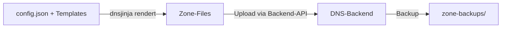

# dnsjinja

`dnsjinja` erzeugt aus modularen [Jinja2](https://palletsprojects.com/p/jinja/)-Templates
Bind9-kompatible Zone-Files und spielt diese als DNS-Zonen ein. Über welche API das
geschieht, entscheidet die Konfiguration: mitgeliefert sind Backends für
[Hetzner Cloud](https://docs.hetzner.cloud/reference/cloud#tag/zone-actions) und
[deSEC](https://desec.readthedocs.io/).

Ein einzelnes Haupt-Template genügt für beliebig viele Domains: Welche DNS-Records
tatsächlich entstehen, steuert eine zentrale Konfigurationsdatei je Domain.

## Wozu dnsjinja?

- **Eine Quelle der Wahrheit** für alle Domains – versioniert in Git statt per Hand
  in der Hetzner-Konsole geklickt.
- **Wiederverwendbare Bausteine**: Mail-, Web- und XMPP-Provider, gemeinsame Gruppen
  und Validierungs-Records werden einmal definiert und per Konfiguration zugeschaltet.
- **Reproduzierbar & automatisierbar**: derselbe Datensatz lokal, im Container oder in
  einer GitHub Action.

## Trennung von Werkzeug und Daten

`dnsjinja` ist bewusst von den Daten getrennt:

| Repository | Inhalt | Beispiel |
|------------|--------|----------|
| **Werkzeug** (`dnsjinja`) | das Python-Tool, per `pip` installiert | dieses Repository |
| **Daten-Repository** | `config.json` + Templates je Domain | `samples/` (anonymisiert) |

Das Daten-Repository wird über `--datadir` bzw. `DNSJINJA_DATADIR` referenziert.
Die anonymisierten Beispiele in dieser Doku stammen aus dem mitgelieferten Verzeichnis
[`samples/`](https://github.com/kaijen/dnsjinja/tree/main/samples) – ein vollständiger,
lauffähiger Datensatz mit `example.com`/`example.org`/`example.net` und
RFC-5737-Platzhalter-IPs.

## Ablauf in drei Schritten

1. **Rendern** – aus Konfiguration und Templates entstehen Zone-Files.
2. **Hochladen** – die Records werden mit der Hetzner-Zone synchronisiert.
3. **Sichern** – vor jedem Lauf wird die bestehende Zone exportiert.

## Weiter geht's

- [Installation](installation.md) – pip, virtuelle Umgebung oder Docker
- [Schnellstart](schnellstart.md) – vom Token zum ersten Upload
- [Konfiguration](konfiguration.md) – Aufbau der `config.json`
- [Template-Architektur](templates.md) – wie die Includes zusammenspielen
- [Beispiel: Domain zusammensetzen](beispiel.md) – ein vollständiger Walkthrough
- [CLI-Referenz](cli.md) – alle Kommandos und Optionen
- [GitHub Actions](github-actions.md) – automatisches Publizieren

!!! note "Voraussetzungen"
    Ein **Hetzner-Cloud-API-Token** (Bearer) mit Lese-/Schreibrechten aus der
    [Hetzner Cloud Console](https://console.hetzner.cloud/). Die alten
    `Auth-API-Token` von `dns.hetzner.com` funktionieren **nicht** mehr.
